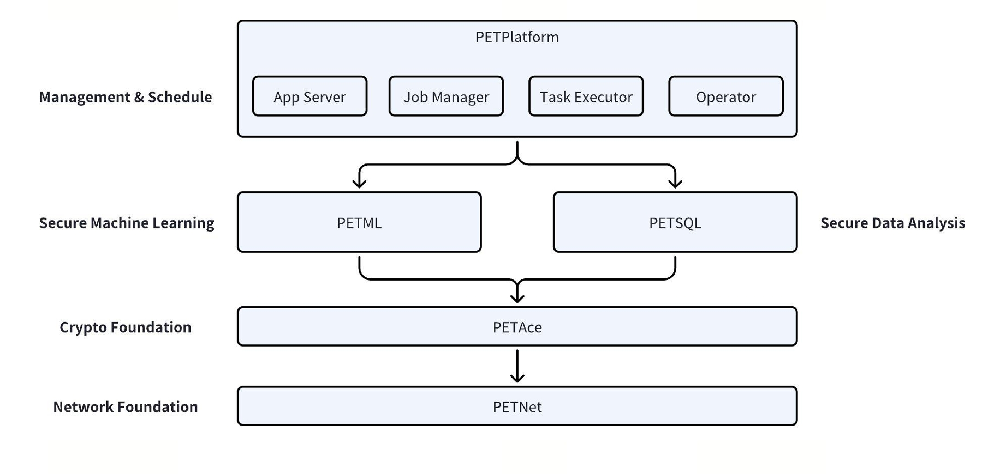

# PrivacyGo-PETPlatform

PrivacyGo-PETPlatform provides users with a one-stop solution builder for integrating privacy enhancing technologies on a large data scale, which offers distributed task management and modular implementation. The whole system consists of four key submodules:

- [**PETPlatform**](https://github.com/tiktok-privacy-innovation/PETPlatform): PETPlatform serves as the main repository of the project, and is also a service for job management and scheduling.
It is responsible for coordinating and overseeing the operation of the other three submodules.

- [**PETML**](https://github.com/tiktok-privacy-innovation/PETML): PETML is a machine learning framework based on multi-party computation and federated learning.

- [**PETSQL**](https://github.com/tiktok-privacy-innovation/PETSQL): PETSQL is a data analysis framework based on secure multi-party computation.

- [**PETNet**](https://github.com/tiktok-privacy-innovation/PETNet): PETNet is a lightweight data proxy gateway which supports real-time data exchange between parties.



## Key Designs of PETPlatform

PETPlatform adopts a four-layer architecture: the App Server, the Job Manager, the Task Executor, and the Operator.

- **App Server**: The App Server mainly supports user-level interactions, such as job submission, job status queries, etc.

- **Job Manager**: The Job Manager is responsible for job scheduling based on the Directed Acyclic Graph (DAG) configuration. It determines the execution order of tasks and manages their dependencies.

- **Task Executor**: The Task Executor is responsible for executing tasks handed over by the Job Manager, and it updates and synchronizes the task execution status with the Job Manager in real time.

- **Operator**: The Operator encapsulates different private computing tasks. By abstracting them as Operator objects, the Task Executor can indiscriminately run different privacy computing algorithm protocols, currently provided by PETML and PETSQL.

The end-to-end task execution process in PETPlatform is as follows:

1. The service loads DAG definitions from the configuration file and stores them in the system's database.

2. Users prepare the input data and grant the platform the corresponding data read and write permissions.

3. Users submit task requests through the command line, and the App Server accepts these task requests.

4. The App Server initializes the Job Manager based on user input and the task DAG.

5. According to the DAG, the Job Manager identifies the ready tasks that are dependent on others to be executed and hands them over to the Task Executor.

6. When the task execution is completed, the Task Executor reports the status back to the Job Manager.

7. Steps 5 and 6 are repeated until all tasks are completed. The matching result is then returned to the user.

## Features of PETPlatform

PETPlatform provides a comprehensive suite of privacy computing features, allowing users to perform a wide range of tasks. Here are the key features provided by PETPlatform:

- **Private Set Intersection (PSI)**: PSI is a secure protocol that allows two parties to find common elements in their datasets without revealing any additional information. It is particularly useful in scenarios where data privacy is paramount.

- **SQL on Privacy-Preserved Datasets**: PETPlatform can run OLAP jobs on datasets from two different parties. It computes SQL query results while preserving the privacy of the datasets. This feature enables complex data analysis tasks across multiple parties.

- **Privacy-Preserving XGBoost Classifier**: XGBoost is a popular machine learning library known for its efficiency and effectiveness. PETPlatform provides a privacy-preserving XGBoost classifier that allows users to train classification models with datasets from two parties without compromising data privacy.

- **Privacy-Preserving XGBoost Regressor**: In addition to classification, PETPlatform also provides a privacy-preserving XGBoost model training for regression tasks.

- **XGBoost Classifier Prediction**: PETPlatform supports privacy-preserving prediction tasks with the trained XGBoost classifier model.

- **XGBoost Regressor Prediction**: PETPlatform also supports privacy-preserving prediction tasks with the trained XGBoost regressor model.

- **Leiden Algorithm for Community Detection**: The Leiden algorithm is a method to extract non-overlapping communities from large networks. PETPlatform provides a privacy-preserving Leiden algorithm, enabling users to perform network analysis while keeping the data private.


## Getting Started


### Requirements

| System | Toolchain                     |
|--------|-------------------------------|
| Linux  | Python (==3.9), pip(>=23.3.1) |


### How to Build

Switch your work directory to the root of PETPlatform:

```bash
cd ${PETPLATFORM_ROOT_DIR}
```

Firstly, if you want to build PETAce on yourself, please refer to [Build PETAce](https://github.com/tiktok-privacy-innovation/PETAce?tab=readme-ov-file#building-petace)

```bash
cp ${YOUR_BUILDING_PATH}/petace-0.3.0-py3.whl external/
```

Secondly, you need to download the PETML and PETSQL to the root directory of PETPlatform.

```bash
git clone https://github.com/tiktok-privacy-innovation/PETML .
git clone https://github.com/tiktok-privacy-innovation/PETSQL .
```

Finally, to build PETPlatform as a docker image, execute:

```bash
docker build -t petplatform:latest . -f docker/Dockerfile
```


### Configuration


#### Party Information Config

You need a config file to record all the parties and their application info:

```json
{
  "party_a": {
    "petplatform": {
      "type": 1,
      "url":"http://${ip_address_a}:1234"
    },
    "petnet": [{
      "type": 1,
      "url":"${ip_address_a}:1235"
    }]
  },
  "party_b": {
    "petplatform": {
      "type": 1,
      "url":"http://${ip_address_b}:1234"
    },
    "petnet": [{
      "type": 1,
      "url":"${ip_address_b}:1235"
    }]
  }
}
```


### Environment Variables

| Environment Variable | Default Value                      | Description                                                  | Required |
|----------------------|------------------------------------|--------------------------------------------------------------|----------|
| PARTY                | None                               | Name of the party                                            | Yes      |
| CONFIG_FILE          | "/app/parties/party.json"          | Path to the configuration file                               | No       |
| NETWORK_SCHEME       | "agent"                            | Network scheme                                               | No       |
| PLATFORM_DB_URI      | "sqlite:////app/db/petplatform.db" | Database connection URI                                      | No       |
| PORT_LOWER_BOUND     | "49152"                            | Lower bound of the socket port range                         | No       |
| PORT_UPPER_BOUND     | "65535"                            | Upper bound of the socket port range                         | No       |
| SAFE_WORK_DIR        | "/app/data/"                       | Safe working directory for preventing path traversal attacks | No       |


#### Docker Compose Config

Note that PETPlatform also depends on [PETNet](https://github.com/tiktok-privacy-innovation/PETNet).
Here we show an example of a complete docker-compose.yml.

```yaml
version: '3'
services:
  petplatform:
    image: petplatform:latest
    volumes:
      - ./db:/app/db
      - ./data:/app/data
      - ./logs:/app/logs
      - ./parties:/app/parties
    environment:
      - PARTY=party_a
    ports:
      - "1234:1234"
    depends_on:
      - petnet

  petnet:
    image: petnet:latest
    environment:
      - PARTY=party_a
    volumes:
      - ./parties:/app/parties
      - ./certs:/app/certs
    ports:
      - "1235:1235"
    depends_on:
      - redis

  redis:
    image: redis:6
    volumes:
      - redis-data:/data

volumes:
  redis-data:
```


### How to Run

To run the Docker container using docker-compose:
```bash
docker-compose up -d
```


## User Manual

### How to Submit a Job

First you need prepare your request parameters. Here is a template for running a psi job. You can find more templates in [mission_templates](test/request).

```json
{
    "mission_name": "psi",
    "mission_version": 1,
    "mission_params": {
        "party_a": {
            "column_name": "id",
            "inputs": {
                "data": "data/breast_hetero_mini_server.csv"
            },
            "outputs": {
                "data": "data/psi_result.csv"
            }
        },
        "party_b": {
            "column_name": "id",
            "inputs": {
                "data": "data/breast_hetero_mini_client.csv"
            },
            "outputs": {
                "data": "data/psi_result.csv"
            }
        }
    }
}
```

Then, you can submit a job by executing:

```bash
curl http://${HOSTNAME}/job/submit -H 'Content-Type: application/json' -d@${PATH_TO_YOUR_CONFIG_FILE}
```

Normally you will receive a response like the following.
You need to record your `job_id` for later to query the job status.

```json
{
    "success": true,
    "job_id": "job_id"
}
```

### How to Query Job Status

You can query job status by executing the following command. According to the job status, your response may look different.

```bash
curl http://${HOSTNAME}/job/status?job_id=${YOUR_JOB_ID}
```


### User APIs

| Endpoint      | Method | Description             | Request Params                                                                                                                                                                           | Response                                                                                                                                                                       | Example                                                                    |
|---------------|--------|-------------------------|------------------------------------------------------------------------------------------------------------------------------------------------------------------------------------------|--------------------------------------------------------------------------------------------------------------------------------------------------------------------------------|----------------------------------------------------------------------------|
| `/job/submit` | `POST` | Submit a computing job  | `mission_name`: (string) The name of the mission (e.g., "psi").<br>`mission_version`: (integer) The version of the mission.<br>`mission_params`: (object) The parameters of the mission. | Success: `success` (boolean), `job_id` (string)<br>Failure: `success` (boolean), `error_message` (string)                                                                      | `{ "mission_name": "psi", "mission_version": 1, "mission_params": {...} }` |
| `/job/status` | `GET`  | Query job status        | `job_id`: (string) The ID of the job.                                                                                                                                                    | `status` (string): The status of the job ("RUNNING", "FAILED", "SUCCESS").<br>`progress` (string): The progress of the job.<br>`task_status` (object): The status of the task. | `{ "job_id": "xxx" }`                                                      |
| `/job/kill`   | `POST` | Terminate a running job | `job_id`: (string) The ID of the job.                                                                                                                                                    | Success: `success` (boolean)<br>Failure: `success` (boolean), `error_message` (string)                                                                                         | `{ "job_id": "xxx" }`                                                      |
| `/job/rerun`  | `POST` | Rerun a failed job      | `job_id`: (string) The ID of the job.                                                                                                                                                    | Success: `success` (boolean)<br>Failure: `success` (boolean), `error_message` (string)                                                                                         | `{ "job_id": "xxx" }`                                                      |


### Trouble Shooting

If you encounter problems while using the PETPlatform service, you can follow the steps below for self-check.
If you still have more questions, you may report your bug to the community.

1. Ensure that the PETPlatform Docker image you are using is up-to-date.
2. Check if your configuration files (e.g., `party.json`) are correct. Ensure all keys and values are as expected, with no spelling errors or missing items.
3. Check if your `docker-compose.yml` file is correct. Ensure all services, environment variables, volumes, and port mappings are configured correctly.
4. Check if your containers are running.
5. Refer to the error message for more details about the specific error.


## Contribution

Please check [Contributing](CONTRIBUTING.md) for more details.


## Code of Conduct

Please check [Code of Conduct](CODE_OF_CONDUCT.md) for more details.


## License

This project is licensed under the [Apache-2.0 License](LICENSE).


## Disclaimers

This software is not an officially supported product of TikTok. It is provided as-is, without any guarantees or warranties, whether express or implied.
