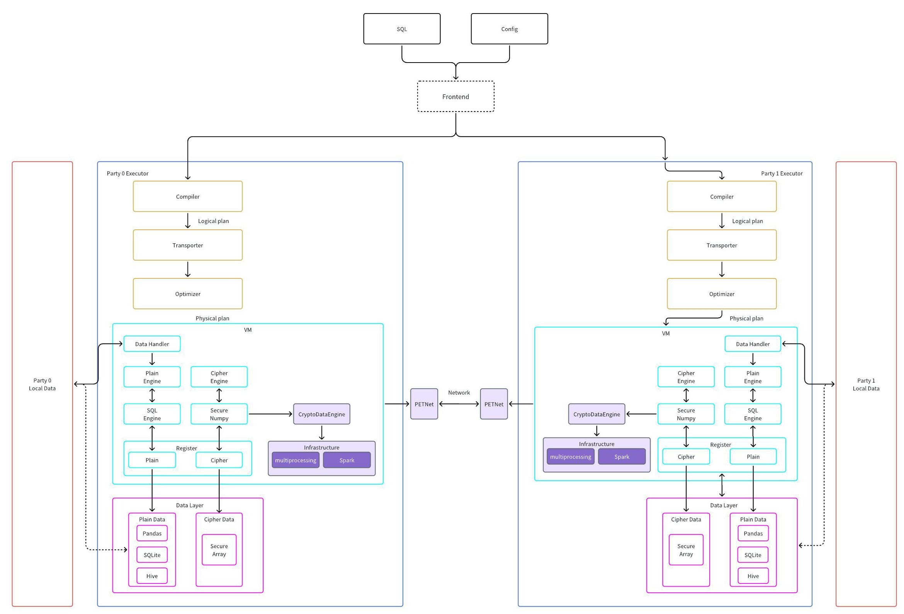
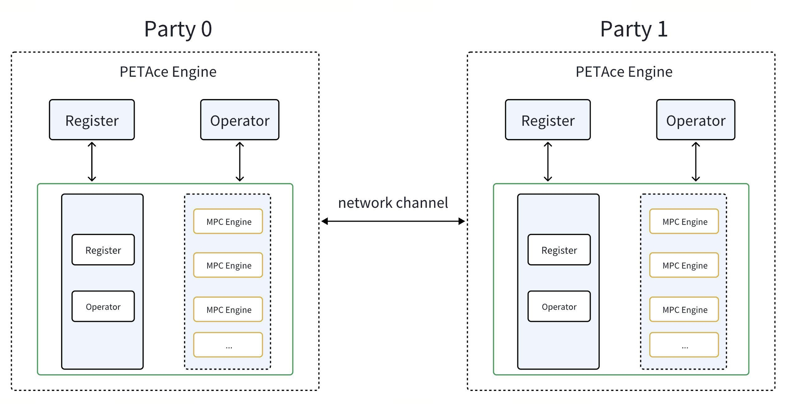
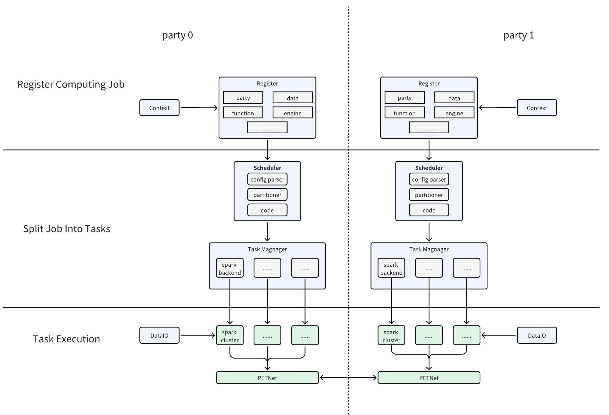

# Secure Collaborative Analytics on Big Data

## Introduction

Increasing data privacy awareness and regulations mark significant progress in safeguarding user data. However, they also create fresh challenges in cross-domain data analysis. Many businesses require multi-party data for purposes like joint advertising attribution between advertisers and ad platforms, or collaborative risk management among financial institutions. Secure Multi-Party Computation (MPC) offers an effective approach by enabling cross-party data collaboration while safeguarding each party’s data privacy and providing provable security guarantees. However, due to the substantial computational and communication overhead of MPC protocols, supporting big data in MPC remains challenging. Consequently, both industry and academia are urgently seeking solutions that enable MPC to handle large-scale data and meet practical business needs.
We design and develop a privacy computing framework that integrates MPC with the Spark big data engine, allowing users to initiate collaborative computing tasks using standard SQL statements. Designed specifically for big data privacy needs, the framework encapsulates data objects and computational operations. As a result, by enabling the framework to handle big data objects and tasks, we can seamlessly extend big data support without requiring any front-end modifications.


## Architecture Design

### Overall



In PETSQL, data operations are split into two parts: a plaintext engine and a ciphertext engine. The plaintext engine leverages Spark to support big data computations, while the ciphertext engine employs PETAce to enable secure big data processing.

### Supporting bigdata computation in PETAce



Thanks to the comprehensive abstraction and modular design of the PETAce system, we have separated the front-end from the back-end through virtual machine architecture. As a result, supporting requires only implementing a big data version of the virtual machine. This approach enables back-end replacement with no changes to the front-end code.

To implement the big data version of the virtual machine, the following key points need to be addressed:
1. Utilize a big data engine for data storage.
2. Use mapPartitionsWithIndex to invoke PETAce VM on each partition to perform MPC operations. The scheduling will be handled by the big data engine's own scheduler.
3. Since operators are already mapped to VM instructions, the framework can pass these instructions directly without delving into their internal implementation. The main focus lies in transforming data appropriately and managing network connections.

### Bigdata Supporting Interfaces and Infrastructures

Our key design objectives are as follows:
1. Big-data Capability: Our solution provides multiple big data functionalities such as data parallelism, multi-instance scheduling, and multi-machine resource management capabilities for existing secure computation frameworks (such as PETAce).
2. Enhance Flexibility for Various Scenarios: For opensource, we hope developers can experience the acceleration effect of the ciphertext engine even without big data engines. For production use, we hope businesses can freely choose the appropriate big data engine according to business needs.
3. High Performance Across Different Scales: We aim at achieving high performance at various data scales on both single-machine settings and distributed cluster settings.



We divide the entire task execution cycle into three stages: registration, graph construction, and execution:
1. Registration stage: The caller registers the following information with the framework:
   1. Party information (party config): (name, index, server address, ...)
   2. Dataset information (data config): (name, path, storage type, schema, ...)
   3. Executable code and partitioner (exec code): (op / func list, data list, data partitioner, ...)
   4. Other configurations, such as engine configurations, etc.
2. Graph construction stage: The framework manages data alignment and partitioning based on the registered information, splits tasks, and obtains a DAG composed of several subtasks.
3. Execution stage: The DAG is scheduled to Spark or other distributed clusters for execution according to the granularity of the subtasks.


## Benchmarks

### Secure Operators

| Test case | Data size (rows) | Sequential | Multiprocess                                         | Spark                                                |
|-----------|------------------|------------|------------------------------------------------------|------------------------------------------------------|
| mul       | 10^6             | 46.38      | 8c8p 11.49 <br> 16c16p 6.94 <br> 32c32p 6.84         | 8c8p 26.49 <br> 16c16p 23.70 <br> 32c32p 23.46       |
|           | 10^7             | 467.95     | 8c8p 84.30 <br> 16c16p 55.81 <br> 32c32p 46.91       | 8c8p 97.56 <br> 16c16p 71.00 <br> 32c32p 61.30       |
|           | 10^8             | *4689      | 8c8p 805.63 <br> 16c16p 521.77 <br> 32c32p 403.45    | 8c8p 843.64 <br> 16c16p 565.06 <br> 32c32p 445.80    |
| div       | 10^6             | 3351.41    | 8c8p 431.71 <br> 16c16p 233.70 <br> 32c32p 169.72    | 8c8p 449.93 <br> 16c16p 238.83 <br> 32c32p 171.40    |
|           | 10^7             | *33510     | 8c8p 5052.33 <br> 16c16p 2303.23 <br> 32c32p 1742.45 | 8c8p 4392.38 <br> 16c16p 2240.32 <br> 32c32p 1508.40 |
| gt        | 10^6             |            | 8c8p 36.29 <br> 16c16p 21.28 <br> 32c32p 13.71       | 8c8p 52.69 <br> 16c16p 37.59 <br> 32c32p 53.47       |
|           | 10^7             |            | 8c8p 766.59 <br> 16c16p 490.33 <br> 32c32p 218.29    | 8c8p 792.13 <br> 16c16p 531.87 <br> 32c32p 221.45    |


### Secure SQL

| Test case                                                                                                                                                                                                                                                                                                                                   | Data size (rows) | Sequential | Multiprocess (best effort) | Spark (best effort) |
|---------------------------------------------------------------------------------------------------------------------------------------------------------------------------------------------------------------------------------------------------------------------------------------------------------------------------------------------|------------------|------------|----------------------------|---------------------|
| SELECT b.f3 as f3, sum(b.f1) as sum_f, sum(b.f1 + b.f2) as sum_f2, max(b.f1 * b.f1 + a.f1 - a.f1 / b.f1) AS max_f, min(b.f1 * a.f1 + 1) as max_f4 FROM (select id1, id2, f1 from table_from_a where f1 < 90) AS a JOIN (select id1, id2, f1 + f2 + 2.01 as f1, f1 * f2 + 1 as f2, f3 from table_from_b) AS b ON a.id1 = b.id1 GROUP BY b.f3 | 10^6 vs. 10^6    | 604.22     | 8c8p 764.24                | 8c8p 801.33         |
| SELECT b.f3 as f3, sum(b.f1) as sum_f, sum(b.f1 + b.f2) as sum_f2, max(b.f1 * b.f1 + a.f1 - a.f1 / b.f1) AS max_f, min(b.f1 * a.f1 + 1) as max_f4 FROM (select id1, id2, f1 from table_from_a where f1 < 90) AS a JOIN (select id1, id2, f1 + f2 + 2.01 as f1, f1 * f2 + 1 as f2, f3 from table_from_b) AS b ON a.id1 = b.id1 GROUP BY b.f3 | 10^7 vs. 10^7    | *6040      | 32c32p 4749.50             | 32c32p 4833.21      |


## User Manual

### PETSQL

For PETSQL building and installation, please refer to [PETAce Readme](https://github.com/tiktok-privacy-innovation/PETSQL/blob/main/README.md).

### PETAce

For PETAce building and installation, please refer to [PETAce Readme](https://github.com/tiktok-privacy-innovation/PETAce/blob/main/README.md).

### Examples

Here we give a simple example to run protocols in PETAce.

#### SetOps
To run python examples, execute the following in commands in separate terminal sessions.

```bash
python3 ./example/setops/ecdh_psi.py -p 0
python3 ./example/setops/ecdh_psi.py -p 1
```

#### SecureNumpy

To run python examples, execute the following in commands in separate terminal sessions.

```bash
python3 ./example/securenumpy/linear_regression.py -p 0
python3 ./example/securenumpy/linear_regression.py -p 1
```

#### Bigdata
When using the big data engine, you only need to update the part related to engine initialization, while the rest remains consistent. However, there are some points to note:
- The number of rows in the data cannot be less than the number of partition.
- Some functions, such as reshape, are not supported in big data mode and will result in errors. This is because big data inherently does not support these operations.


### CryptoDataEngine

For CryptoDataEngine building and installation, please refer to [PETAce Readme](https://github.com/tiktok-privacy-innovation/CryptoDataEngine/blob/main/README.md).
